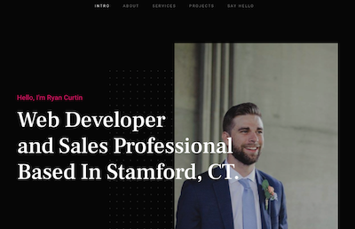

# GameTagr
The following application is my portfolio showcasing my projects that I have worked through UConn' Coding Bootcamp.  Links to my resume, LinkedIn, and GitHub are provided, as well as contact information.  The page is built out using CSS and JavaScript, as well as utilizing a template from StyleShout with my own designs throughout the page.  

## Table of Contents

* [Installation](#Installation)
* [Usage](#Usage)
* [License](#License)
* [Badges](#Badges)
* [Contributing](#Contributing)

## Installation

* Clone repo, then run in browser.

## Usage
Showcase my projects and work history.

[Github Repository](https://github.com/rpc08002/Portfolio)

[Live URL](https://rpc08002.github.io/Portfolio/)

## License

[MIT](https://choosealicense.com/licenses/mit/)

## Badges

## Contributing
* Ryan Curtin
* StyleShout

### Covenant Code of Conduct

This Code of Conduct is adapted from the [Contributor Covenant][homepage],
version 2.0, available at
https://www.contributor-covenant.org/version/2/0/code_of_conduct.html.

Community Impact Guidelines were inspired by [Mozilla's code of conduct
enforcement ladder](https://github.com/mozilla/diversity).

[homepage]: https://www.contributor-covenant.org